# **TRABAJO PRÁCTICO Nº 2: Lenguajes Regulares, Expresiones Regulares y Autómatas Finitos**
## **Ejercicio 1. Descripción verbal de expresiones regulares**
**Consigna: Dar expresiones verbales de los lenguajes descriptos por las siguientes
expresiones regulares.**

1. a* + b + a
    a* = {$\lambda$, a, aa, aaa, ...}
    b = b
    a = a
    **Respuesta:** El conjunto de todas las cadenas formadas únicamente por letras 'a' (incluyendo la cadena vacía), o la cadena formada por una sola 'b'.
    {$\lambda$, a, b, aa, aaa, ...}
    &nbsp;
2. a* b + b + a 
    a*b = {$\lambda$b, ab, aab, aaab, ...}
    b = b
    a = a
    **Respuesta:** El conjunto de todas las cadenas formadas por letras 'a' con una b despues, o la cadena formada por una sola 'b' o 'a'.
    {b, a, ab, aab, aaab, ...}
    &nbsp;
3. aa*(a+b)
    aa* = {a$\lambda$, aa, aaa, aaaa, aaaaa, ...}
    a+b = {a, b}
    **Respuesta:** "Cadenas que comienzan con al menos una 'a' y terminan con un solo símbolo, que puede ser 'a' o 'b'.
    {aa, ab, aaa, aab, aaaa, aaab, ...}
&nbsp;
4. abab* + aba*
    abab* = {aba$\lambda$, abab, ababb, ababbb, ababbbb, ...}
    aba* = {ab$\lambda$, aba, abaa, abaaa, ...}
    **Respuesta:** "Cadenas que comienzan con 'aba' seguidas únicamente de cero o más 'b', o cadenas que comienzan con 'ab' seguidas únicamente de cero o más 'a'"
    {aba, abaa, abab, abaaa, ababb, ...}
&nbsp;
5. (ab + abc)*
    **Respuesta:** "Cadenas formadas por cualquier combinación o repetición de los bloques 'ab' y 'abc', incluyendo la cadena vacía".
    {$\lambda$, ab, abc, abab, ababc, abcab, abcab, ...}
&nbsp;
6. ab* aa + bba* ab
    ab* = {a$\lambda$, ab, abb, abbb, ...}
    aa = {aa}
    bba* = {bb$\lambda$, bba, bbaa, bbaaa, ...}
    ab = ab
    **Respuesta:** "Cadenas que comienzan con 'a', tienen cero o más 'b' en el medio y terminan en 'aa'; o cadenas que comienzan con 'bb', tienen cero o más 'a' en el medio y terminan en 'ab'"
    {aaa, bbab, abaa, bbaab, ...}
&nbsp;
7. (aa)* b(aa)* + a(aa)* ba (aa)*
    (aa)* = {$\lambda$, aa, aaaa, aaaaaa, ...}
    b(aa)* = {b$\lambda$, baa, baaaa, baaaaaa, ...}
    a(aa)* = {a$\lambda$, aaa, aaaaa, aaaaaaa, ...}
    **Respuesta:** "Cadenas que contienen exactamente una 'b' rodeada de grupos de 'a' de la misma paridad (ambos grupos pares o ambos grupos impares), resultando siempre en una cadena de longitud total impar"
    {b, aab, baa, aabaa, aba, aaaba, abaaa, ...}
&nbsp;

**I. Verificación por traza: Para los ítems a, b y c, determiná si cada cadena pertenece o no al
lenguaje. Justificá indicando qué parte de la expresión regular "consume" cada símbolo de la
cadena (es decir qué parte de la expresión actúa en cada símbolo que se está leyendo).**

|Cadena|a*+b+a|a*b+b+a|aa*(a+b)|
|:---:|:---:|:---:|:---:|
|$\lambda$|No|No|No|
|a|Si|Si|No|
|b|Si|Si|No|
|aa|Si|Si|Si|
|ab|No|Si|Si|
|bba|No|No|No|
|aaab|No|Si|Si|

&nbsp;

**II. Detección de errores**
Expresión c) aa*(a+b ⇒ descripción propuesta: "todas las cadenas formadas por letras a y b
que contienen al menos una a"
¿Es correcta? Si no lo es, encontrá un contraejemplo para justificar.
**Respuesta:** "Cadenas de longitud 2 o más que comienzan con una o más 'a' y terminan con una 'a' o una 'b', sin permitir que haya 'b's en medio de la cadena"
&nbsp;
Expresión g) (aa)* b(aa)* + a(aa)* ba(aa)* descripción propuesta: ⇒ "cadenas con exactamente
una b, donde la cantidad total de símbolos es par"
¿Es correcta? Si no lo es, encontrá un contraejemplo para justificar.
**Respuesta:** "Cadenas con exactamente una 'b', donde la cantidad de 'a' a la izquierda tiene la misma paridad que la cantidad de 'a' a la derecha".
&nbsp;
**III. Casos límite**
Para los ítems d, e y f respondé las siguientes preguntas antes de escribir tu descripción verbal:
* ¿Acepta la cadena vacía (λ)? Justificá.
d: Si
e: Si
f: No

* ¿Acepta cadenas de un solo símbolo? ¿En caso afirmativo, cuáles?
d: No
e: No
f: No

* ¿Existe alguna longitud mínima de cadena aceptada? ¿Si existe, cuál es?
d: 0
e: 0
f: 3

## **Ejercicio 2. Encontrando la expresión regular de un lenguaje**
Sea T el lenguaje definido sobre Σ = {a, b, c} / T = {a, c, ab, cb, abb, cbb, abbb, cbbb,
abbbb, cbbbb, …}. Encontrar la expresión regular que lo define.

**I. Tabla de casos de prueba (completá la tabla ANTES de escribir la expresión)**
|Cadena|¿Pertenece?|
|:-:|:-:|
|$\lambda$|No|
|a|Si|
|b|No|
|c|Si|
|ab|Si|
|bb|No|
|acb|No|
|abbb|Si|
|cbbbb|Si|
|abc|No|
&nbsp;

**II. ¿Refinamos?**
    Un alumno de la clase propuso la expresión regular (a+c)b* como solución a la descripción del lenguaje definido.

* ¿La expresión es correcta? Si no es correcta, ¿qué acepta que no debería, o qué rechaza que debería aceptar?
    Si, es correcta.
* Corregí la expresión en caso de ser necesario.
    No es necesaria, la expresión $(a+c)b^*$ define perfectamente al lenguaje $T$.

&nbsp;

## **Ejercicio 3. Expresiones regulares con condiciones de cantidad**
Sea T el lenguaje sobre Σ = {a, b, c}. Encontrá expresiones regulares para:
&nbsp;
    1. con al menos dos a, siendo Σ = {a, b}
    L = (a + b)* . a . (a + b)* . a (a + b)*
&nbsp;
    2.  con al menos una a y al menos una b
    L = (a + b + c)* . a . (a + b + c)* . b . (a + b + c)* + (a + b + c)* . b (a + b + c)* . a . (a + b + c)*
&nbsp;
    3. con exactamente dos a
    L = (b + c)* . a . (b + c)* . (b + c)*
&nbsp;
**I. Tabla de casos de prueba (completá la tabla ANTES de escribir las expresiones)**
|Cadena|(a) ≥2 a's, Σ={a,b}|(b) ≥1a y ≥1b|(c) exactamente 2 a's|
|:-:|:-:|:-:|:-:|
|$\lambda$|No|No|No|
|a|No|No|No|
|b|No|No|No|
|aa|Si|No|Si|
|ab|No|Si|No|
|ba|No|Si|No|
|aab|Si|Si|Si|
|aba|Si|Si|Si|
|bab|No|Si|No|
|aaa|Si|No|No|
|bba|No|Si|No|
|aaba|Si|Si|No|
|abca|No|Si|Si|
|aacbb|No|Si|Si|

**II. Análisis de errores**
Para el ítem c (expresión para exactamente dos a’s), una inteligencia artificial propone la siguiente
expresión: b* ab* ab*
* ¿Funciona cuando Σ = {a, b}? 
Si
* ¿Y cuando Σ = {a, b, c}? ¿Qué cambia?
Funciona pero nunca presenta un simbolo c.

## **Ejercicio 4. Expresiones regulares para lenguajes definidos formalmente**
Encontrá una expresión regular para cada uno de los siguientes lenguajes.
&nbsp;
**I. Preguntas de análisis (respondé ANTES de construir la ER)**
1. {aⁿ | n ≥ 0, n ≠ 4}
* ¿Pertenece λ al lenguaje? ¿Por qué?
Si, porque cuando n = 0 el caracter correspondiente es λ.
&nbsp;
* ¿Pertenece aaaa? ¿Por qué?
No, porque en este caso $n = 4$, y la condición del lenguaje prohíbe explícitamente que $n$ sea igual a 4 ($n \ne 4$).
&nbsp;
* ¿Pertenece aaaaa? ¿Por qué?
Si, porque su longitud es $n = 5$. Como $5 \ge 0$ y $5 \ne 4$, cumple con las reglas del lenguaje.
&nbsp;
* ¿Por qué este lenguaje es más difícil de expresar con ER que sólo a*?
Porque tiene una condición donde prohibe que n nunca puede ser 4.
&nbsp;
* Un compañero propuso escribirlo como "a* menos aaaa". ¿Eso es una expresión regular válida? Esta pregunta la vas a poder contestar más adelante ¿Qué herramienta usarías si las ER son muy complejas como para que puedas armarlas para describir un lenguaje?
No, el lenguaje es L = $\lambda$ + a + aa + aaa + aaaaaa*

2.  {aⁿbᵐ | n+m es par}

|n|m|n+m|¿Par?|Cadena|¿Pertenece?|
|:-:|:-:|:-:|:-:|:-:|:-:|
|0|0|0|Si|$\lambda$|Si|
|1|0|1|No|a|No|
|0|1|1|No|b|No|
|1|1|2|Si|ab|Si|
|2|0|2|Si|aa|Si|
|2|1|3|No|aab|No|
|2|2|4|Si|aabb|Si|
|3|1|4|Si|aaab|Si|

3. {w ∈ {a,b}* | #a(w) y #b(w) son ambos pares}
* ¿Cuántos "estados" de paridad distintos existen para el par (#a mod 2, #b mod 2)?
* ¿Cómo se relaciona eso con la estructura de la expresión regular?
* Verificá que tu expresión acepta: ε, aabb, abab, baba — y rechaza: ab, a, ba, aab

4. Números binarios con exactamente un par de ceros consecutivos

|Cadena|¿Contiene exactamente un '00'?|¿Pertenece?|
|:-:|:-:|:-:|
|100|Si|Si|
|1001|Si|Si|
|10010|Si|Si|
|1000|No|No|
|0011|Si|Si|
|11|No|No|
|001|Si|Si|

5. Los números binarios que terminan en 01.
$$(0+1)^* 01$$

6. Números binarios que contienen un número par de ceros. Detección del error: la siguiente expresión fue propuesta como solución: 1*(01* 01* )*
* 0: No la acepta, cant impares de 0s.
* 00: La acepta
* 10: No la acepta
* 0010: No la acepta
* 000: No la acepta
&nbsp;
7. {$a^n b^m$ | n ≥ 2, m ≥ 1}
$$aa a^* b b^*$$
8. Los números binarios en los que la subcadena 00 aparece a lo sumo dos veces.
$$1^*(01+1^*)^*(\lambda + 0)(00 (1^*(01+1^*)^*(\lambda + 0)) + \lambda)(00 (1^*(01+1^*)^*(\lambda + 0)) + \lambda)$$ 
9. Los números binarios en los que la subcadena 00 va seguida siempre por un 1.
$$(1 + 01 + 001)^* (\lambda + 0)$$
10. Todas las cadenas sobre ∑={a, b, c} que contienen exactamente una a
$$(b + c)^* a (b + c)^* $$
11. Todas las cadenas sobre ∑={a, b, c} que contienen al menos una a.
$$(a + b + c)^* a (a + b + c)^* $$
12. Todas las cadenas sobre ∑={a, b, c} en las que todos los grupos de una o más aes consecutivas tienen una longitud que es múltiplo de tres.
$$(aaa + b + c)^*$$

## **Ejercicio 5 — Construcción de autómatas finitos**
**Construir autómatas finitos para los siguientes lenguajes.**
1. Constantes reales con signo (por ejemplo: 42,0 o -99,99)

|Estado|-|0-9|,|Aceptacion?|
|:-:|:-:|:-:|:-:|:-:|
|q0|q1|q2|-|No|
|q1|-|q2|-|No|
|q2|-|q2|q3|Si|
|q3|-|q4|-|No|
|q4|-|q4|-|Si|

2. Comentarios acotados por /* y */

|Estado|/|*|carácter|Aceptacion?|
|:-:|:-:|:-:|:-:|:-:|
|q0|q1|-|-|No|
|q1|-|q2|-|No|
|q2|q2|q3|q2|No|
|q3|q4|q3|q2|No|
|q4|-|-|-|Si|

3. Constantes reales con notación exponencial (por ejemplo: 3.14e5, 1.6e-19)

|Estado|-|0-9|,|e|Aceptacion?|
|:-:|:-:|:-:|:-:|:-:|:-:|
|q0 (Inicio)|q1|q2|-|-|No|
|q1|-|q2|-|-|No|
|q2 (Entero)|-|q2|q3|-|Si|
|q3 (Coma)|-|q4|-|-|No|
|q4 (Real)|-|q4|-|-|Si|
|q5 (Exp)|q6|q7|-|-|No|
|q6 (Signo exp)|-|q7|-|-|No|
|q7|-|q7|-|-|Si|

4. Identificadores de cualquier longitud que comiencen con una letra y contengan letras, dígitos o guiones, que no contengan dos guiones seguidos ni terminen con guión.

|Estado|letra|digito|guion|Aceptacion?|
|:-:|:-:|:-:|:-:|:-:|
|q0|q1|-|-|No|
|q1|q1|q1|q2|Si|
|q2|q1|q1|-|No|

5. L = {$x = a^i b^j$ v $x = (cd^{2n + 1} / i ≥ 0, n, j ≥ 1 $}

|Estado|a|b|c|d|Aceptacion?|
|:-:|:-:|:-:|:-:|:-:|:-:|
|q0|q1|q2|q3|-|No|
|q1|q1|q2|-|-|No|
|q2|-|q2|-|-|Si|
|q3 (Espera d)|-|-|-|q4|No|
|q4 (Fin cd1)|-|-|q5|-|No|
|q5 (Espera d)|-|-|-|q6|No|
|q6 (Fin cd2)|-|-|q7|-|No|
|q7 (Espera d)|-|-|-|q8|No|
|q8 (Fin cd3)|-|-|q5|-|Si|

6. L = {x#y / x = $a^{2p + 1}$ ^ $( y = c^i d^j$ v y = $b^n a^m )$ ^ p, m , n ≥ 1^ i, j ≥ 0 }

|Estado|a|#|c|d|b|Aceptacion?|
|:-:|:-:|:-:|:-:|:-:|:-:|:-:|
|q0|q1|-|-|-|-|No|
|q1|q2|-|-|-|-|No|
|q2|q3|-|-|-|-|No|
|q3|q2|q4|-|-|-|No|
|q4|-|-|q4|q5|q6|Si|
|q5|-|-|-|q5|-|Si|
|q6|q7|-|-|-|q6|No|
|q7|q7|-|-|-|-|Si|

7. Cadenas que contengan 3 ceros consecutivos, Σ = {0,1}

|Cadena|Esperado|Obtenido por traza|Estado fianl alcanzado|
|:-:|:-:|:-:|:-:|
|000|$\checkmark$|$q_0 \xrightarrow{0} q_1 \xrightarrow{0} q_2 \xrightarrow{0} q_3$|q3|
|1000|$\checkmark$|$q_0 \xrightarrow{1} q_0 \xrightarrow{0} q_1 \xrightarrow{0} q_2 \xrightarrow{0} q_3$|q3|
|0001|$\checkmark$|$q_0 \xrightarrow{0} q_1 \xrightarrow{0} q_2 \xrightarrow{0} q_3 \xrightarrow{1} q_3$|q3|
|00|$X$|$q_0 \xrightarrow{0} q_1 \xrightarrow{0} q_2$|q2|
|0011000|$\checkmark$|$q_0 \xrightarrow{0} q_1 \xrightarrow{0} q_2 \xrightarrow{1} q_0 \xrightarrow{1} q_0 \xrightarrow{0} q_1 \xrightarrow{0} q_2 \xrightarrow{0} q_3$|q3|
|1001001|$X$|$q_0 \xrightarrow{1} q_0 \xrightarrow{0} q_1 \xrightarrow{0} q_2 \xrightarrow{1} q_0 \xrightarrow{0} q_1 \xrightarrow{0} q_2 \xrightarrow{1} q_0$|q0|
|$\lambda$|$X$|$q_0$ (sin transiciones)|q0|

8. Cadenas que NO contengan dos unos consecutivos, Σ = {0,1}
* ¿Acepta λ? ¿Por qué?
Si, porque la cadena vacia no tiene dos unos consecutivos.
* ¿Qué le pasa al autómata si ya leyó '11'? ¿Puede "recuperarse" y volver a aceptar?
Una vez que aparecen los dos unos consecutivos, la cadena queda invalidada para siempre.
* ¿Es necesario un estado trampa o sumidero? ¿Qué implica incluirlo?
SÍ. Necesitamos un estado (llamémoslo q2) al que el autómata vaya cuando detecte el error (11). Una vez ahí, cualquier entrada (0 o 1) lo mantiene en ese estado de rechazo.

|Cadena|Esperado|Obtenido por traza|Estado fianl alcanzado|
|:-:|:-:|:-:|:-:|
|$\lambda$|$\checkmark$|q0|q0|
|0|$\checkmark$|$q_0 \xrightarrow{0} q_0$|q0|
|10|$\checkmark$|$q_0 \xrightarrow{1} q_1 \xrightarrow{0} q_0$ |q0|
|101|$\checkmark$|$q_0 \xrightarrow{1} q_1 \xrightarrow{0} q_0 \xrightarrow{1} q_1$|q1|
|110|$X$|$q_0 \xrightarrow{1} q_1 \xrightarrow{1} q_2 \xrightarrow{0} q_2$|q2|
|1010|$\checkmark$|$q_0 \xrightarrow{1} q_1 \xrightarrow{0} q_0 \xrightarrow{1} q_1 \xrightarrow{0} q_0$|q0|
|10110|$X$|$q_0 \xrightarrow{1} q_1 \xrightarrow{0} q_0 \xrightarrow{1} q_1 \xrightarrow{1} q_2  \xrightarrow{0} q_2$|q2|

9. Cadenas con número impar de ceros y par de unos, Σ = {0,1}

|Cadena|Esperado|Obtenido por traza|
|:-:|:-:|:-:|
|$\lambda$|$X$|q0|
|0|$\checkmark$|$q_0 \xrightarrow{0} q_1$|
|1|$X$|$q_0 \xrightarrow{1} q_2$|
|01|$X$|$q_0 \xrightarrow{0} q_1 \xrightarrow{1} q_3$|
|10|$X$|$q_0 \xrightarrow{1} q_2 \xrightarrow{0} q_3$|
|001|$X$|$q_0 \xrightarrow{0} q_1 \xrightarrow{0} q_0 \xrightarrow{1} q_2$|
|010|$X$|$q_0 \xrightarrow{0} q_1 \xrightarrow{1} q_3 \xrightarrow{0} q_2$|
|0011|$X$|$q_0 \xrightarrow{0} q_1 \xrightarrow{0} q_0 \xrightarrow{1} q_2 \xrightarrow{0} q_2$|
|011|$\checkmark$|$q_0 \xrightarrow{0} q_1 \xrightarrow{1} q_3 \xrightarrow{1} q_1$|
|000|$\checkmark$|$q_0 \xrightarrow{0} q_1 \xrightarrow{0} q_0 \xrightarrow{0} q_1$|

10. L = { $a^{2k} b^{3n}$ / k ≥ 1, n ≥ 0 }

|Estado|a|b|Aceptacion?|
|:-:|:-:|:-:|:-:|
|q0|q1|-|No|
|q1|q2|-|No|
|q2|q0|q3|Si|
|q3|-|q4|No|
|q4|-|q5|No|
|q5|-|q3|Si|

11. L = { $d^{2n+1}$ / n ≥ 0 }

|Estado|d|Aceptacion?|
|:-:|:-:|:-:|
|q0|q1|No|
|q1|q0|Si|

12. L= { $(ab)^n c^3 (ba)^m$ / n ≥ 1, m ≥ 0 }

|Estado|a|b|c|Aceptacion?|
|:-:|:-:|:-:|:-:|:-:|
|q0|q1|-|-|-|No|
|q1|-|q2|-|No|
|q2|q1|-|q3|No|
|q3|-|-|q4|No|
|q4|-|-|q5|No|
|q5|-|q6|-|Si|
|q6|q5|-|-|No|

**Detección de error en autómata propuesto**

|$\lambda$|0|1|
|:-:|:-:|:-:|
|q0|q1|q0|
|q1*|q2|q0|
|q2*|q2|q0|

* Hacé la traza de la cadena 000: ¿el autómata la acepta? ¿debería?
$q_0 \xrightarrow{0} q_1 \xrightarrow{0} q_2 \xrightarrow{0} q_2$
Si, el automata lo acepta, porque q2 es estado de aceptacion.
&nbsp;

* Hacé la traza de la cadena 0001: ¿el autómata la acepta? ¿debería?
$q_0 \xrightarrow{0} q_1 \xrightarrow{0} q_2 \xrightarrow{0} q_2 \xrightarrow{1} q_0$
No, ya que q0 no es estado de aceptacion.
&nbsp;

* Hacé la traza de la cadena 00010001: ¿el autómata la acepta? ¿debería?
$q_0 \xrightarrow{0} q_1 \xrightarrow{0} q_2 \xrightarrow{0} q_2 \xrightarrow{1} q_0 \xrightarrow{0} q_1 \xrightarrow{0} q_2 \xrightarrow{0} q_2 \xrightarrow{1} q_0$
No, ya que q0 no es estado de aceptacion.
&nbsp;

* ¿Qué lenguaje acepta realmente este autómata? ¿Es el pedido?
Este autómata acepta cadenas que terminen con al menos un cero. No, no es el pedido
&nbsp;
* Corregí el autómata.

|$\lambda$|0|1|
|:-:|:-:|:-:|
|q0|q1|q0|
|q1|q2|q0|
|q2|q3|q0|
|q3*|q3|q3|

## **Ejercicio 6 — AFND para el lenguaje (ab+abc)**
Diseñar un AFND que acepte (ab+abc)*. Explicá por qué no puede resolverse con menos de
tres estados.

|Estado|a|b|c|Aceptacion?|
|:-:|:-:|:-:|:-:|:-:|
|q0|q1|-|-|Si|
|q1|-|q2|-|No|
|q2|q1|-|q0|Si|

**6.A. Análisis previo**
* ¿Acepta la cadena vacía? ¿Qué implica eso para el estado inicial?
Si, acepta la cadena vacia.
&nbsp;
* ¿Qué cadenas cortas (longitud ≤ 4) pertenecen al lenguaje? Hacé una lista.
{$\lambda$, ab, abc, abab}
&nbsp;
* ¿Cuál es la diferencia entre ab y abc dentro de la expresión? ¿Cómo afecta eso al diseño
del autómata?
Ambas comparten el prefijo ab. La diferencia es que una termina ahí y la otra requiere un carácter adicional (c).
Esto obliga a que el estado alcanzado tras leer ab sea un "punto de decisión" (estado no determinista).
&nbsp;

**6.B. Verificación del AFND**

|Cadena|Conjunto de estados activos|¿Es aceptada?|
|:-:|:-:|:-:|
|$\lambda$|q0|Si|
|ab|$q_0 \xrightarrow{a} q_1 \xrightarrow{b} q_2$|Si|
|abc|$q_0 \xrightarrow{a} q_1 \xrightarrow{b} q_2 \xrightarrow{c} q_0$|Si|
|abab|$q_0 \xrightarrow{a} q_1 \xrightarrow{b} q_2 \xrightarrow{a} q_1 \xrightarrow{b} q_2$|Si|
|ababc|$q_0 \xrightarrow{a} q_1 \xrightarrow{b} q_2 \xrightarrow{a} q_1 \xrightarrow{b} q_2 \xrightarrow{c} q_3$|Si|
|ac||No|
|ba||No|

**6.C. Argumento sobre cantidad mínima de estados**
Para justificar que no alcanza con dos estados, construí el argumento:
* Suponé que tenés un AFND con sólo dos estados. ¿Cómo serían esos estados y cuáles serían finales?
Si tuviéramos solo dos estados ($q_0$ y $q_1$), para cumplir con la cadena mínima y la cadena vacía, pero a la hora de cumplir con abc deberia ser la transicion de q_0 hacia q_0, lo cual haria que tambien se acepte la cadena c sola, la cual no esta en el lenguaje.
* Intentá definir las transiciones para que acepte ab. ¿Qué pasa cuando intentás que también acepte abc sin aceptar ac?

## **Ejercicio 7 — AFND para a*+b+a con cuatro estados**
**7.A. Análisis del lenguaje**

|Cadena|Parte de a?|Parte de a+b?|Pertenece a a*+b+a?|
|:-:|:-:|:-:|:-:|
|$\lambda$|No|No|Si|
|a|Si|Si|Si|
|aa|No|No|Si|
|b|No|Si|Si|
|ba|No|No|No|
|bba|No|No|No|
|ab|No|No|No|
|bb|No|No|No|

**7.B. Diseño y verificación**
* Diseñá el AFND con exactamente cuatro estados.
    * $q_0$ (Inicial): Es el punto de partida no determinista. Debe ser Final para aceptar $\lambda$.
    * $q_1$: Se encarga de la rama $a^*$. Tiene un bucle con $a$ y es Final.
    * $q_2$: Se encarga de la rama del medio ($b$). Se llega con $b$ desde $q_0$ y es Final.
    * $q_3$: Se encarga de la rama de la derecha ($a$ sola). Se llega con $a$ desde $q_0$ y es Final.

|Estado|a|b|Final?|
|:-:|:-:|:-:|:-:|
|q0|{q1, q3}|q2|Si|
|q1|q1|-|Si|
|q2|-|-|Si|
|q3|-|-|Si|

* Indicá cuáles estados corresponden a qué parte del lenguaje (a* vs. b+a).
* Hacé la traza a todas las cadenas de la tabla anterior y mostrá los conjuntos de estados activos (Podés usar JFlap).

|Cadena|Traza|Aceptada?|
|:-:|:-:|:-:|
|$\lambda$|$q_0$|Si|
|a|$q_0 \xrightarrow{a} ${$q_1, q_3$}|Si|
|aa|$q_0 \xrightarrow{a} $ {$q_1, q_3$} $ \xrightarrow{a} {q_1}$|Si|
|b|$q_0 \xrightarrow{b} {q_2}$|Si|
|ba|$q_0 \xrightarrow{b} {q_2} \xrightarrow{a} \emptyset$|No|
|bba|$q_0 \xrightarrow{b} {q_2} \xrightarrow{b} \emptyset$|No|
|ab|$q_0 \xrightarrow{a} $ {$q_1, q_3$} $\xrightarrow{b} \emptyset$|No|
|bb|$q_0 \xrightarrow{b} {q_2} \xrightarrow{b} \emptyset$|No|

## **Ejercicio 8 — Obtener el AFD equivalente a un AFND**

**8.A. Obtener el autómata determinista para el autómata A1**
A1 = $( Q = {q_0, q_1, q_2, q_3}, Σ = {a, b}, F = {q_3}, Δ_1)$, donde:

|$Δ_1$|a|b|
|:-:|:-:|:-:|
|q0|{q0, q1}|q0|
|q1|q2|q0|
|q2|q3|q0|
|q3|q3|q3|

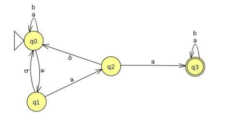

|Nuevo nombre|$\delta_1$|a|b|a|b|
|:-:|:-:|:-:|:-:|:-:|:-:|
|A|q0|{q0, q1}|q0|B|A|
|B|{q0, q1}|{q0, q1, q2}|q0|C|A|
|C|{q0, q1, q2}|{q0, q1, q2, q3}|q0|D|A|
|D*|{q0, q1, q2, q3}|{q0, q1, q2, q3}|{q0, q3}|D|E|
|E*|{q0, q3}|{q0, q1, q3}|{q0, q3}|F|E|
|F*|{q0, q1, q3}|{q0, q1, q2, q3}|{q0, q3}|D|E|

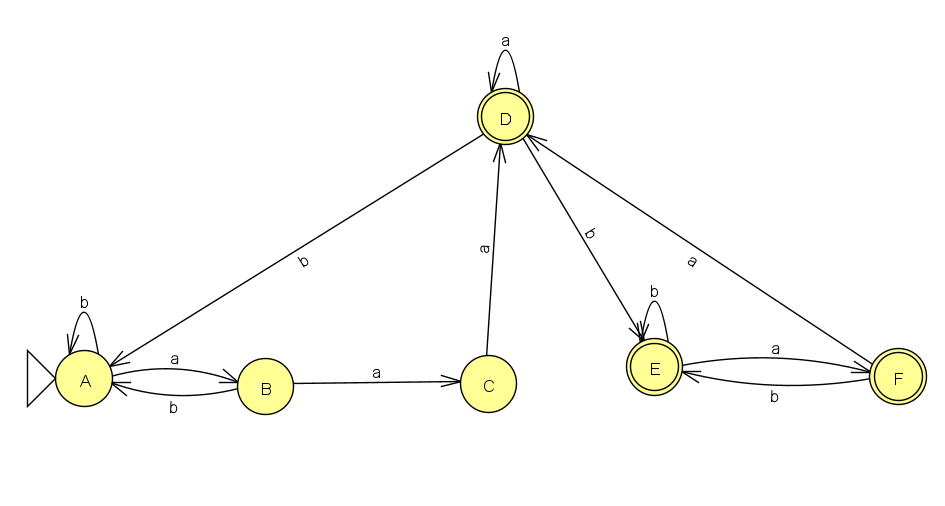

AFD = ( Q = {A,B,C,D,E,F}, $\Sigma$ = {a,b}, F = {D,E,F}, $q_0$ = A, $\delta_1$)

**8.B. Obtener el autómata determinista para el autómata A2**
A2 = ( Q = { q0,q1,q2,q3,q4,q5,q6,q7 }, Σ={a, b}, F = {q3,q7}, $Δ_2$)

|$Δ_2$|a|b|$\lambda$|
|:-:|:-:|:-:|:-:|
|q0|q4|q6|q1|
|q1|q2|q4|-|
|q2|{q2, q3}|-|{q3, q7}|
|q3|-|q3|-|
|q4|q5|-|-|
|q5|q5|q4|q6|
|q6|q7|-|-|
|q7|q7|-|q0|

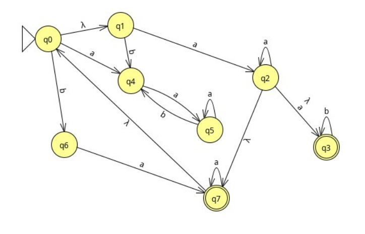

**Clausuras $\lambda$:**
$\lambda$ {$q_0$} = {$q_0, q_1$}
$\lambda$ {$q_1$} = {$q_1$}
$\lambda$ {$q_2$} = {$q_0, q_1, q_2, q_3, q_7$}
$\lambda$ {$q_3$} = {$q_3$}
$\lambda$ {$q_4$} = {$q_4$}
$\lambda$ {$q_5$} = {$q_5, q_6$}
$\lambda$ {$q_6$} = {$q_6$}
$\lambda$ {$q_7$} = {$q_0, q_1, q_7$}

F = $\lambda$ {$q_2$}, $\lambda$ {$q_3$}, $\lambda$ {$q_7$}

**Función de próximo estado P:**

**$\lambda$ {$q_0$} = {$q_0, q_1$}**

P({$q_0, q_1$}, a) = {$q_2, q_4$} => $\lambda$ {$q_2$} U $\lambda$ {$q_4$} = {$q_0, q_1, q_2, q_3, q_4, q_7$}

P({$q_0, q_1$}, b) = {q4, q6} => $\lambda$ {$q_4$} U $\lambda$ {$q_6$} = {$q_4, q_6$}

**$\lambda$ {$q_1$} = {$q_1$}**

P({$q_1$}, a) = {q2} = $\lambda$ {$q_2$} = {$q_0, q_1, q_2, q_3, q_7$}

P({$q_1$}, b) = {$q_4$}

**$\lambda$ {$q_2$} = {$q_0, q_1, q_2, q_3, q_7$}**

P({$q_0, q_1, q_2, q_3, q_7$}, a) = {q2, q3, q4, q5} = {$q_0, q_1, q_2, q_3, q_4, q_7$}

P({$q_0, q_1, q_2, q_3, q_7$}, b) = {q3, q4, q6} = {$q_3, q_4, q_6$}

**$\lambda$ {$q_3$} = {$q_3$}**

P({$q_3$}, a) = $\empty$

P({$q_3$}, b) = {q3} = {$q_3$}

**$\lambda$ {$q_4$} = {$q_4$}**

P({$q_4$}, a) = {q5} = {$q_5, q_6$}

P({$q_4$}, b) = $\empty$

**$\lambda$ {$q_5$} = {$q_5, q_6$}**

P({$q_5, q_6$}, a) = {q5, q7} =  {$q_0, q_1, q_5, q_6, q_7$}

P({$q_5, q_6$}, b) = {q4} = {$q_4$}

**$\lambda$ {$q_6$} = {$q_6$}**

P({$q_6$}, a) = {q7} = {$q_0, q_1, q_7$}

P({$q_6$}, b) = $\empty$

**$\lambda$ {$q_7$} = {$q_0, q_1, q_7$}**

P({$q_0, q_1, q_7$}, a) = {q2, q4, q7} = {$q_0, q_1, q_2, q_3, q_4, q_7$}

P({$q_0, q_1, q_7$}, b) = {q4, q6} = {$q_4, q_6$}

**Nuevos estados:**

P({$q_0, q_1, q_2, q_3, q_4, q_7$}, a) = {q2, q3, q4, q5, q7} = {$q_0, q_1, q_2, q_3, q_4, q_5, q_6, q_7$}

P({$q_0, q_1, q_2, q_3, q_4, q_7$}, b) = {q3, q4, q6} = {$q_3, q_4, q_6$}

P({$q_4, q_6$}, a) = {q5, q7} = {$q_0, q_1, q_5, q_6, q_7$}

P({$q_4, q_6$}, b) = $\empty$

P({$q_0, q_1, q_2, q_3, q_4, q_5, q_6, q_7$}, a) = {$q_0, q_1, q_2, q_3, q_4, q_5, q_6, q_7$}

P({$q_0, q_1, q_2, q_3, q_4, q_5, q_6, q_7$}, b) = {q3, q4, q6} = {$q_3, q_4, q_6$}

P({$q_3, q_4, q_6$}, a) = {q5, q7} = {$q_0, q_1, q_5, q_6, q_7$}

P({$q_3, q_4, q_6$}, b) = {q3} = {$q_3$}

P({$q_0, q_1, q_5, q_6, q_7$}, a) = {q2, q4, q5, q7} = {$q_0, q_1, q_2, q_3, q_5, q_4, q_6, q_7$}

P({$q_0, q_1, q_5, q_6, q_7$}, b) = {q4, q6} = {$q_4, q_6$}

|Nuevo nombre|$\delta_2$|a|b|a|b|
|:-:|:-:|:-:|:-:|:-:|:-:|
|A|<$q_0, q_1$>|<$q_0, q_1, q_2, q_3, q_4, q_7$>|<$q_4, q_6$>|B|C|
|B*|<$q_0, q_1, q_2, q_3, q_4, q_7$>|<$q_0, q_1, q_2, q_3, q_4, q_5, q_6, q_7$>|<$q_3, q_4, q_6$>|D|E|
|C|<$q_4, q_6$>|<$q_0, q_1, q_5, q_6, q_7$>|-|F|-|
|D*|<$q_0, q_1, q_2, q_3, q_4, q_5, q_6, q_7$>|<$q_0, q_1, q_2, q_3, q_4, q_5, q_6, q_7$>|<$q_3, q_4, q_6$>|D|E|
|E*|<$q_3, q_4, q_6$>|<$q_0, q_1, q_5, q_6, q_7$>|<$q_3$>|F|G|
|F*|<$q_0, q_1, q_5, q_6, q_7$>|<$q_0, q_1, q_2, q_3, q_4, q_5, q_6, q_7$>|<$q_4, q_6$>|D|C| 
|G*|<$q_3$>|-|<$q_3$>|-|G|

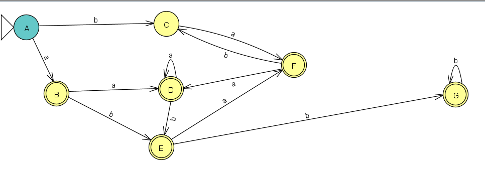

AFD = ( Q = {A,B,C,D,E,F,G}, $\Sigma$ = {a,b}, F = {B,D,E,F,G}, $q_0$ = A, $\delta_2$)

**8.C. Obtener el autómata determinista para el autómata A3**

A3 = ( Q = { q0,q1,q2,q3,q4,q5,q6,q7 }, Σ={a, b}, F = {q3,q7}, $Δ_3$)

|$Δ_3$|a|b|$\lambda$|
|:-:|:-:|:-:|:-:|
|q0|q4|q6|q1|
|q1|q2|q4|q2|
|q2|{q2, q3}|q7|q7|
|q3|-|q3|-|
|q4|q5|-|-|
|q5|q5|q4|q6|
|q6|q7|-|-|
|q7|q7|-|q0|

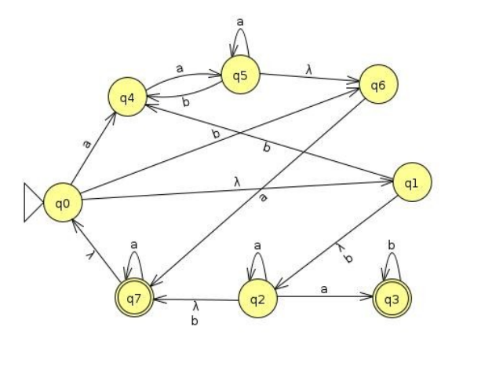

**Clausuras $\lambda$:**
$\lambda$ {$q_0$} = {$q_0, q_1, q_2, q_7$}
$\lambda$ {$q_1$} = {$q_0, q_1, q_2, q_7$}
$\lambda$ {$q_2$} = {$q_0, q_1, q_2, q_7$}
$\lambda$ {$q_3$} = {$q_3$}
$\lambda$ {$q_4$} = {$q_4$}
$\lambda$ {$q_5$} = {$q_5, q_6$}
$\lambda$ {$q_6$} = {$q_6$}
$\lambda$ {$q_7$} = {$q_0, q_1, q_2, q_7$}

F = $\lambda$ {$q_0$}, $\lambda$ {$q_1$}, $\lambda$4, q_6, q_7{$q_2$}, $\lambda$ {$q_7$}

**Función de próximo estado P:**

**$\lambda$ {$q_0$} = {$q_0, q_1, q_2, q_7$}**

P({$q_0, q_1, q_2, q_7$}, a) = {q2, q3, q4, q7} = {$q_0, q_1, q_2, q_3, q_4, q_7$}

P({$q_0, q_1, q_2, q_7$}, b) = {q4, q6, q7} = {$q_0, q_1, q_2, q_4, q_6, q_7$}

**$\lambda$ {$q_1$} = {$q_0, q_1, q_2, q_7$}**

P({$q_0, q_1, q_2, q_7$}, a) = {q2, q3, q4, q7} = {$q_0, q_1, q_2, q_3, q_4, q_7$}

P({$q_0, q_1, q_2, q_7$}, b) = {q4, q6, q7} = {$q_0, q_1, q_2, q_4, q_6, q_7$}

**$\lambda$ {$q_2$} = {$q_0, q_1, q_2, q_7$}**

P({$q_0, q_1, q_2, q_7$}, a) = {q2, q3, q4, q7} = {$q_0, q_1, q_2, q_3, q_4, q_7$}

P({$q_0, q_1, q_2, q_7$}, b) = {q4, q6, q7} = {$q_0, q_1, q_2, q_4, q_6, q_7$}

**$\lambda$ {$q_5$} = {$q_5, q_6$}**

P({$q_5, q_6$}, a) = {q5, q7} = {$q_0, q_1, q_2, q_5, q_6, q_7$}

P({$q_5, q_6$}, b) = {q4} = $q_4$

**$\lambda$ {$q_7$} = {$q_0, q_1, q_2, q_7$}**

P({$q_0, q_1, q_2, q_7$}, a) = {q2, q3, q4, q7} = {$q_0, q_1, q_2, q_3, q_4, q_7$}

P({$q_0, q_1, q_2, q_7$}, b) = {q4, q6, q7} = {$q_0, q_1, q_2, q_4, q_6, q_7$}

**Nuevos estados:**
P({$q_0, q_1, q_2, q_3, q_4, q_7$}, a) = {q2, q3, q4, q5, q7} = {$q_0, q_1, q_2, q_3, q_4, q_7$}

P({$q_0, q_1, q_2, q_3, q_4, q_7$}, b) = {q3, q4, q6, q7} = {$q_0, q_1, q_2, q_3, q_4, q_6, q_7$}

p({$q_0, q_1, q_2, q_4, q_6, q_7$}, a) = {q2, q3, q4, q5, q7} = {$q_0, q_1, q_2, q_4, q_6, q_7$}

p({$q_0, q_1, q_2, q_4, q_6, q_7$}, b) = {q4, q6, q7} = {$q_0, q_1, q_2, q_4, q_6, q_7$}

P({$q_0, q_1, q_2, q_3, q_4, q_6, q_7$}, a) = {q2, q3, q4, q5, q7} = {$q_0, q_1, q_2, q_3, q_4, q_5, q_6, q_7$}

P({$q_0, q_1, q_2, q_3, q_4, q_6, q_7$}, b) = {q3, q4, q6, q7} = {$q_0, q_1, q_2, q_3, q_4, q_6, q_7$}

|Nuevo nombre|$\delta_2$|a|b|a|b|
|:-:|:-:|:-:|:-:|:-:|:-:|
|A*|<$q_0, q_1, q_2, q_7$>|<$q_0, q_1, q_2, q_3, q_4, q_7$>|<$q_0, q_1, q_2, q_4, q_6, q_7$>|B|C|
|B*|<$q_0, q_1, q_2, q_3, q_4, q_7$>|<$q_0, q_1, q_2, q_3, q_4, q_7$>|<$q_0, q_1, q_2, q_3, q_4, q_6, q_7$>|B|D|
|C*|<$q_0, q_1, q_2, q_4, q_6, q_7$>|<$q_0, q_1, q_2, q_4, q_6, q_7$>|<$q_0, q_1, q_2, q_4, q_6, q_7$>|C|C|
|D*|<$q_0, q_1, q_2, q_3, q_4, q_6, q_7$>|<$q_0, q_1, q_2, q_3, q_4, q_5, q_6, q_7$>|<$q_0, q_1, q_2, q_3, q_4, q_6, q_7$>|E|D|
|E*|<$q_0, q_1, q_2, q_3, q_4, q_5, q_6, q_7$>|<$q_0, q_1, q_2, q_3, q_4, q_5, q_6, q_7$>|<$q_0, q_1, q_2, q_3, q_4, q_5, q_6, q_7$>|E|E|

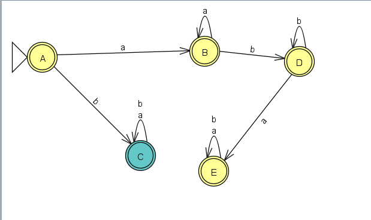

AFD = ( Q = {A,B,C,D,E}, $\Sigma$ = {a,b}, F = {A,B,C,D,E}, $q_0$ = A, $\delta_3$)

**8.D. Obtener el autómata determinista para el autómata A4**

A4 = ( Q = {q0, q1, q2, q3}, Σ={0, 1}, q0, $Δ_4$, F={q3}>

|$Δ_4$|0|1|
|:-:|:-:|:-:|
|q0|{q1, q3}|q1|
|q1|q2|{q1, q2}|
|q2|q2|q3|
|q3|-|q0|

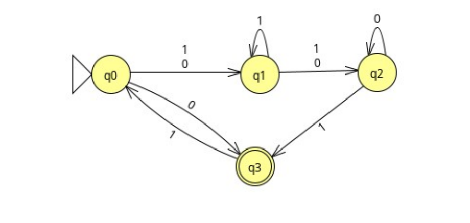

|Nuevo nombre|$\delta_4$|0|1|0|1|
|:-:|:-:|:-:|:-:|:-:|:-:|
|A|q0|<q1, q3>|q1|B|C|
|B*|<q1, q3>|q2|<q0, q1, q2>|D|E|
|C|q1|q2|<q1, q2>|D|F|
|D|q2|q2|q3|D|G|
|E|<q0, q1, q2>|<q1, q2, q3>|<q1, q2, q3>|H|H|
|F|<q1, q2>|q2|<q1, q2, q3>|D|H|
|G*|q3|-|q0|-|A|
|H*|<q1, q2, q3>|q2|<q0, q1, q2, q3>|D|J|
|J*|<q0, q1, q2, q3>|<q1, q2, q3>|<q0, q1, q2, q3>|H|J|

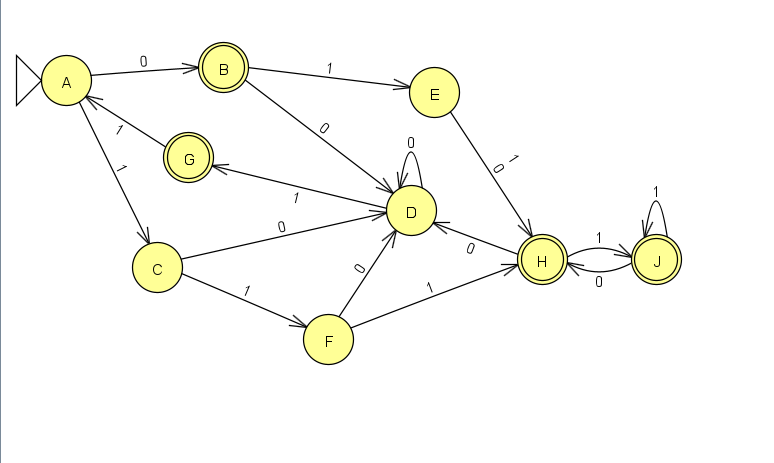

AFD = ( Q = {A,B,C,D,E,F,G,H,J}, $\Sigma$ = {0,1}, F = {B,G,H,J}, $q_0$ = A, $\delta_4$)

**8.E. Obtener el autómata determinista para el autómata A5**

A5 = (Q = {q0, q1, q2, q3}, Σ = {a, b, c, d}, q0, $Δ_5$, F={q2}) 

|$Δ_5$|a|b|c|d|
|:-:|:-:|:-:|:-:|:-:|
|q0|{q1, q2}|q3|q2|q2|
|q1|-|q3|q2|q2|
|q2|-|-|-|-|
|q3|-|{q1, q3}|-|-|

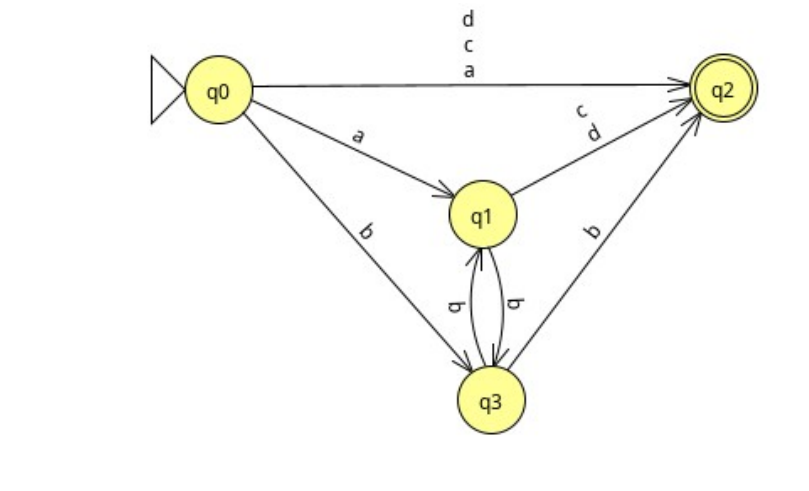

|Nuevo nombre|$\delta_4$|a|b|c|d|a|b|c|d|
|:-:|:-:|:-:|:-:|:-:|:-:|:-:|:-:|:-:|:-:|
|A|q0|<q1, q2>|q3|q2|q2|B|C|D|D|
|B*|<q1, q2>|-|q3|q2|q2|-|C|D|D|
|C|q3|-|<q1, q3>|-|-|-|E|-|-|
|D*|q2|-|-|-|-|-|-|-|-|
|E|<q1, q3>|<q1, q2>|<q1, q3>|q2|q2|B|E|-|-|

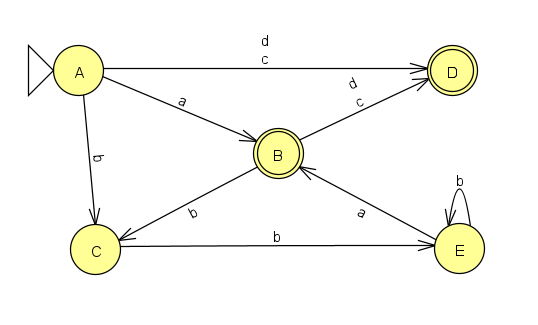

AFD = ( Q = {A,B,C,D,E}, $\Sigma$ = {a,b,c,d}, F = {B,D}, $q_0$ = A, $\delta_5$)

## **Ejercicio 9 — Minimización de autómatas finitos**

**9.A. Minimizar AFD1**

AFD1 = (Q={q0,q1,q2,q3}, Σ={a,b}, q0, $δ_1$, F={q0}) 

|$δ_1$|a|b|
|:-:|:-:|:-:|
|q0*|q0|q1|
|q1|q2|q0|
|q2|q3|q0|
|q3|q1|q0|

**Q/E0**

C1 = {q1, q2, q3} = B
C2 = {Q0} = A

|$δ_1$|a|b|
|:-:|:-:|:-:|
|q1|C1|C2|
|q2|C1|C2|
|q3|C1|C2|

**Minimizado:**

|$δ_1$|a|b|
|:-:|:-:|:-:|
|A*|A|B|
|B|B|A|

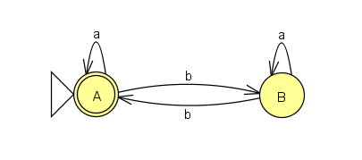

**9.B. Minimizar AFD2**
AFD2 = ( Q={q0, q1, q2, q3, q4, q5}, Σ={a, b}, q0, $δ_2$, F={q1, q3, q5})

|$δ_2$|a|b|
|:-:|:-:|:-:|
|q0|q1|q2|
|q1*|q0|q3|
|q2|q3|q0|
|q3*|q3|q2|
|q4|q5|q1|
|q5*|q3|q4|

**Q/E0**

C1 = {q1, q3}
C2 = {q0, q2}

|$δ_2$|a|b|
|:-:|:-:|:-:|
|q1|C2|C1|
|q3|C1|C2|

|$δ_2$|a|b|
|:-:|:-:|:-:|
|q0|C1|C2|
|q2|C1|C2|

**Q/E1**

C1 = {q1} = A
C2 = {q3} = B
C3 = {q0, q2} = C

|$δ_2$|a|b|
|:-:|:-:|:-:|
|q0|C1|C3|
|q2|C2|C3|

**Q/E2**

C1 = {q1} = A
C2 = {q3} = B
C3 = {q0} = C
C4 = {q2} = D

**Minimizado:**

|$δ_2$|a|b|
|:-:|:-:|:-:|
|A*|A|D|
|B*|C|B|
|C|B|C|
|D|B|A|

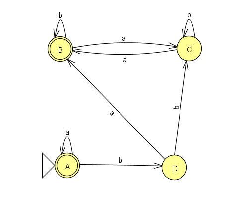

**9.C. Minimizar AFD3**

AFD3 = ( Q={p, q, r, s, t, u}, Σ={a, b}, p, $δ_3$, F={q, r})

|$δ_3$|a|b|
|:-:|:-:|:-:|
|p|q|p|
|q*|r|s|
|r*|q|t|
|s|t|u|
|t|s|u|
|u|q|u|

**Q/E0**

C1 = {q, r}
C2 = {p, s, t, u}

|$δ_3$|a|b|
|:-:|:-:|:-:|
|q*|C1|C2|
|r*|C1|C2|

|$δ_3$|a|b|
|:-:|:-:|:-:|
|p|C1|C2|
|s|C2|C2|
|t|C2|C2|
|u|C1|C2|

**Q/E1**
C1 = {q, r} = B*
C2 = {p, u} = A
C3 = {s, t} = C

|$δ_3$|a|b|
|:-:|:-:|:-:|
|q*|C1|C3|
|r*|C1|C3|

|$δ_3$|a|b|
|:-:|:-:|:-:|
|p|C1|C2|
|u|C1|C2|

|$δ_3$|a|b|
|:-:|:-:|:-:|
|s|C3|C2|
|t|C3|C2|

**Minimizado:**

|$δ_3$|a|b|
|:-:|:-:|:-:|
|A|B|A|
|B|B|C|
|C|C|A|

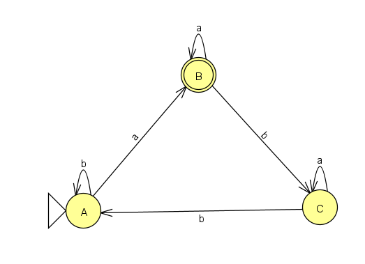

**9.D. Minimizar AFD4**
AFD4 = (Q={q0, q1, q2, q3, q4, q5, q6, q7}, Σ={a, b}, q0, $δ_4$, {q2, q3, q5})

|$δ_4$|a|b|
|:-:|:-:|:-:|
|q0|q1|q3|
|q1|q0|q2|
|q2|q5|q4|
|q3|q5|q3|
|q4|q4|q7|
|q5|-|q4|
|q7|q4|-|

**Q/E0**
C1 = {q2, q3, q5}
C2 = {q0, q1, q4, q7}

|$δ_4$|a|b|
|:-:|:-:|:-:|
|q2|C1|C2|
|q3|C1|C1|
|q5|-|C2|

|$δ_4$|a|b|
|:-:|:-:|:-:|
|q0|C2|C1|
|q1|C2|C1|
|q4|C2|C2|
|q7|C2|-|

**Q/E1**
C1 = {q2}
C2 = {q3}
C3 = {q5}
C4 = {q0, q1}
C5 = {q4}
C6 = {q7}

|$δ_4$|a|b|
|:-:|:-:|:-:|
|q0|C4|C2|
|q1|C4|C1|

**Minimizado:**

|$δ_4$|a|b|
|:-:|:-:|:-:|
|A|B|D|
|B|A|C|
|C|F|E|
|D|F|D|
|E|E|G|
|F|-|E|
|G|E|-|

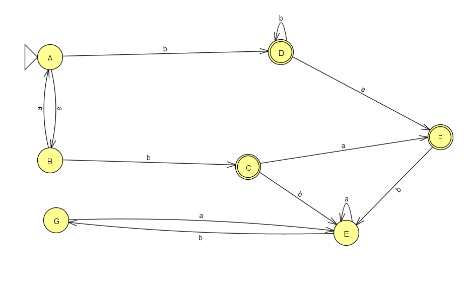

**9.E. Minimizar AFD5**
AFND5 = (Q={p, q, r, s}, Σ={a, b}, p, $δ_5$, F={s})

|$δ_5$|a|b|
|:-:|:-:|:-:|
|p|{q, r, s}|{p, q, r, s}|
|q|-|{p, q, r, s}|
|r|-|{p, q, r, s}|
|s|s|{q, r, s}|

|Nuevo nombre|$δ_5$|a|b|a|b|
|:-:|:-:|:-:|:-:|:-:|:-:|
|A|p|<q, r, s>|<p, q, r, s>|B|C|
|B*|<q, r, s>|s|<p, q, r, s>|D|C|
|C*|<p, q, r, s>|<q, r, s>|<p, q, r, s>|B|C|
|D*|s|s|<q, r, s>|D|B|

AFD5 = (Q={A, B, C, D}, Σ={a, b}, p, $δ_5$, F={B, C, D})

|$δ_5$|a|b|
|:-:|:-:|:-:|
|A|B|C|
|B*|D|C|
|C*|B|C|
|D*|D|B|

**Q/E0**
C1 = {A} = A
C2 = {B, C, D} = B

|$δ_5$|a|b|
|:-:|:-:|:-:|
|B*|C2|C2|
|C*|C2|C2|
|D*|C2|C2|

**Minimizado:**
|$δ_5$|a|b|
|:-:|:-:|:-:|
|A|B|B|
|B|B|B|

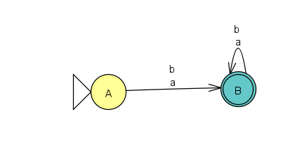

## **Ejercicio 10 — Traductores finitos**

**10.A. Análisis de la traducción T = {(a bʲ, b aʲ) : i,j ≥ 1}**

M = (Q, $\Sigma$, Γ, $\delta, s_0, f_0$)

Q = {q0, q1, q2, ..., q30}
$\Sigma$ = {a, b}
Γ = {a, b}
$s_0$ = q0

|$\delta$|a|b|$f_a$|$f_b$|
|:-:|:-:|:-:|:-:|:-:|
|q0|q1|-|b|-|
|q1|q1|q2|b|a|
|q2|-|q2|-|a|

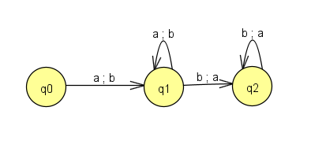

**10.B. Verificación del transductor hex→binario**

M = (Q, $\Sigma$, Γ, $\delta, s_0, f_0$)

Q = {q0, q1, q2}
$\Sigma$ = {0, 1}
Γ = {0, 1, 2, 3, 4, 5, 6, 7, 8, 9, A, B, C, D, E, F}
$s_0$ = q0

|$\delta$|0|1|$f_0$|$f_1$|
|:-:|:-:|:-:|:-:|:-:|
|q0|q1|q16|$\lambda$|$\lambda$|
|q1|q2|q9|$\lambda$|$\lambda$|
|q2|q3|q6|$\lambda$|$\lambda$|
|q3|q4|q5|0|1|
|q4|-|-|-|-|
|q5|-|-|-|-|
|q6|q7|q8|2|3|
|q7|-|-|-|-|
|q8|-|-|-|-|
|q9|q10|q13|$\lambda$|$\lambda$|
|q10|q11|q12|4|5|
|q11|-|-|-|-|
|q12|-|-|-|-|
|q13|q14|q15|6|7|
|q14|-|-|-|-|
|q15|-|-|-|-|
|q16|q17|q24|$\lambda$|$\lambda$|
|q17|q18|q21|$\lambda$|$\lambda$|
|q18|q19|q20|8|9|
|q19|-|-|-|-|
|q20|-|-|-|-|
|q21|q22|q23|A|B|
|q22|-|-|-|-|
|q23|-|-|-|-|
|q24|q25|q28|$\lambda$|$\lambda$|
|q25|q26|q27|C|D|
|q26|-|-|-|-|
|q27|-|-|-|-|
|q28|q29|q30|E|F|
|q29|-|-|-|-|
|q30|-|-|-|-|

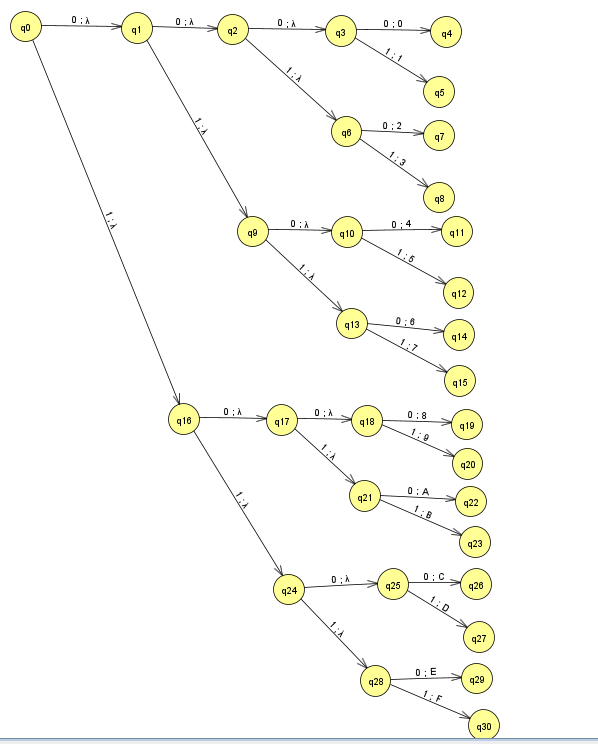

**10.C. Caso límite del traductor de 4 blancos**

M = (Q, $\Sigma$, Γ, $\delta, s_0, f_0$)

Q = {q0, q1, q2, q3, q4}
$\Sigma$ = {caracter, espacio}
Γ = {/t}
$s_0$ = q0

|$\delta$|caracter|blanco|$f_{cararcter}$|$f_{blanco}$|
|:-:|:-:|:-:|:-:|:-:|
|q0|q0|q1|$\lambda$|$\lambda$|
|q1|q0|q2|$\lambda$|$\lambda$|
|q2|q0|q3|$\lambda$|$\lambda$|
|q3|q0|q4|$\lambda$|/t|
|q4|q0|-|$\lambda$|-|

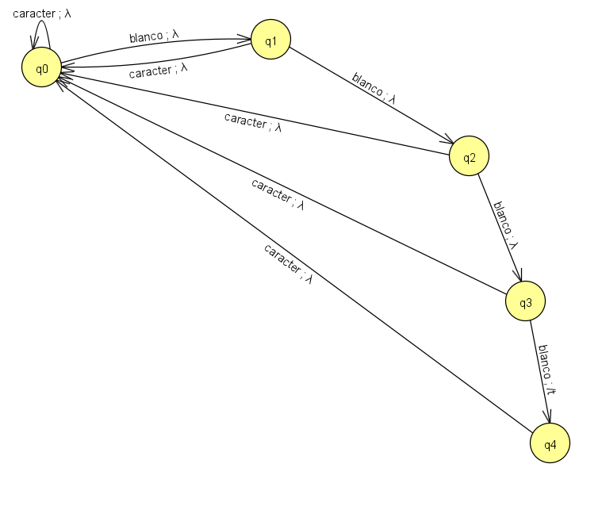